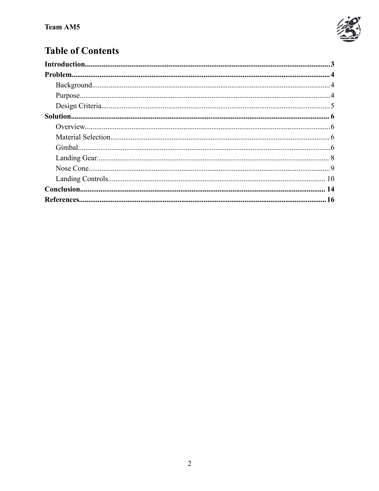
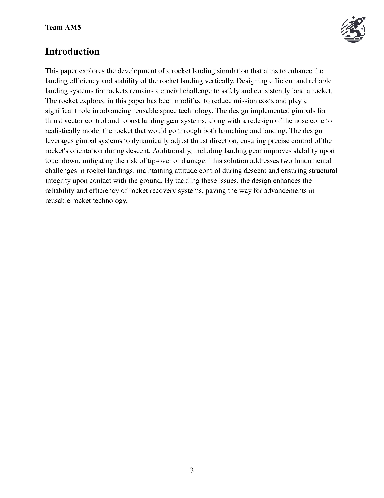

# Project Overview

## Aircraft Trajectory & Landing Simulation (AM5)
This project, completed as part of the Aerospace-Mechanical Track (Team AM5), focused on enhancing a partially pre-built simulation of a landing rocket. The objectives were to design and justify modifications that improved the functionality and realism of the simulation while addressing specific design challenges.

## Key Deliverables:
 - Simulation Code Modifications: Developed and documented logic for alterations to improve trajectory and landing accuracy, with a detailed justification for each change.
 - CAD Model Improvements: Redesigned critical components in the CAD model to enhance structural integrity and landing stability, supported by force diagrams and analysis.
 - Material Selection: Chose materials based on specific performance requirements, providing detailed specifications and rationale for each choice.
Landing Mechanics: Performed calculations for forces acting during landing, incorporating them into design recommendations.
 - Design Recommendations: Proposed realistic and implementable changes for identified problems, backed by clear explanations of expected improvements.

This project showcases our ability to integrate engineering principles, justify technical decisions, and deliver a cohesive solution to a complex aerospace challenge.

# Members

 - [Ian Wilhite](https://www.linkedin.com/in/ian-wilhite/)
 - [Kalen Jaroszewski](https://www.linkedin.com/in/kalen-cole-jaroszewski-a49229271/)
 - [Julia Sopala](https://www.linkedin.com/in/julia-sopala-3475b3298/)
 - [Eduardo Burciaga-Ichikawa](https://www.linkedin.com/in/eduardo-burciaga-ichikawa/)

# Final Report

